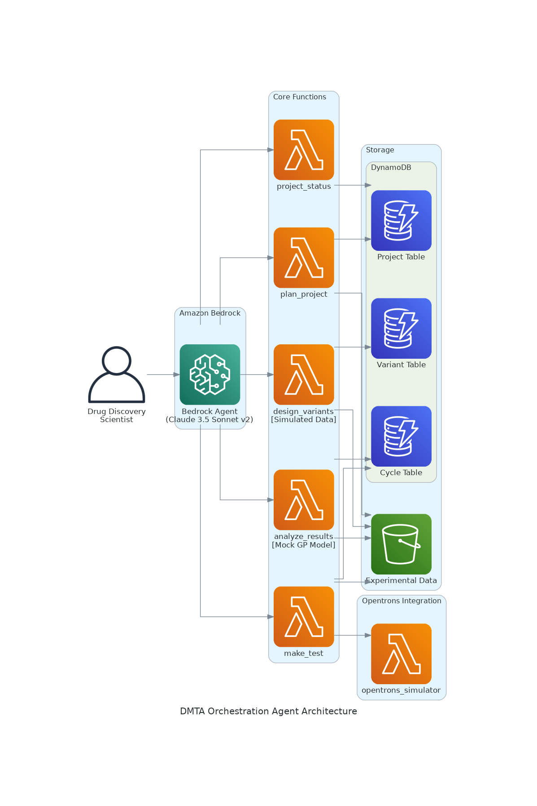

# DMTA Orchestration Agent

Design-Make-Test-Analyze (DMTA) cycle orchestration agent for Cablivi (Caplacizumab) optimization using active learning approaches.

## Overview

This agent helps orchestrate iterative experimental cycles to improve vWF A1 domain binding affinity through active learning approaches. It provides tools for:

- **Plan Project**: Create initial project setup and active learning strategy
- **Design Variants**: Generate nanobody variants using acquisition functions (EI/UCB) [Currently using simulated data]
- **Make Test**: Execute expression and SPR binding assays with Opentrons OT-2 automation [Currently simulation only]
- **Analyze Results**: Analyze results using Gaussian Process modeling and recommend next steps [Currently using mock data]

### Implementation Status

For transparency, the following features are currently implemented using simulations or mock data:

1. **Design Phase**:
   - Variant generation uses simulated sequence data
   - Acquisition functions operate on synthetic binding affinity predictions

2. **Make-Test Phase**:
   - Opentrons OT-2 integration is simulation-based (no hardware required)
   - Expression data is synthetically generated
   - SPR binding assay results use realistic but simulated data

3. **Analysis Phase**:
   - Gaussian Process modeling uses mock hyperparameters
   - Uncertainty estimates are simulated
   - Convergence metrics use synthetic data

These simulated components allow for demonstration and testing of the DMTA workflow while maintaining realistic behavior patterns. Future versions may integrate with actual laboratory hardware and experimental data.

## Prerequisites

1. **AWS Account**: You need an AWS account with appropriate permissions
2. **Bedrock Access**: Request access to the following models:
   - Anthropic Claude 3.5 Sonnet v2
3. **Bedrock Agent Service Role**: Create an IAM role for Bedrock Agent service

### Create Bedrock Agent Service Role

```bash
# Create trust policy
cat > bedrock-agent-trust-policy.json << EOF
{
  "Version": "2012-10-17",
  "Statement": [
    {
      "Effect": "Allow",
      "Principal": {
        "Service": "bedrock.amazonaws.com"
      },
      "Action": "sts:AssumeRole"
    }
  ]
}
EOF

# Create the role
aws iam create-role \
    --role-name AmazonBedrockExecutionRoleForAgents_DMTA \
    --assume-role-policy-document file://bedrock-agent-trust-policy.json

# Attach the required policy
aws iam attach-role-policy \
    --role-name AmazonBedrockExecutionRoleForAgents_DMTA \
    --policy-arn arn:aws:iam::aws:policy/AmazonBedrockFullAccess

# Get the role ARN (you'll need this for deployment)
aws iam get-role \
    --role-name AmazonBedrockExecutionRoleForAgents_DMTA \
    --query 'Role.Arn' \
    --output text
```

## Deployment

### Basic Deployment

**Set required environment variables:**

```bash
export BEDROCK_AGENT_SERVICE_ROLE_ARN="arn:aws:iam::YOUR-ACCOUNT-ID:role/BedrockAgentRole"
export DEPLOYMENT_BUCKET="your-deployment-bucket"
export AWS_DEFAULT_REGION="us-west-2"
```

**Deploy the stack:**

```bash
./deploy.sh
```

This deployment creates:
- ✅ **Basic DMTA Agent**: All Lambda functions and DynamoDB tables
- ✅ **Opentrons Integration**: OT-2 automation with enhanced precision
- ✅ **Data Storage**: S3 bucket for experimental data and DynamoDB tables for metadata tracking

## Architecture



The solution creates:

- **Bedrock Agent**: Orchestrates the DMTA workflow using Claude 3.5 Sonnet v2
- **S3 Bucket**: For storing experimental data
- **DynamoDB Tables**: For tracking projects, cycles, and variants
- **Lambda Functions**: For executing DMTA workflow phases
  - plan_project: Project planning and initialization
  - design_variants: Variant design using active learning [Simulated Data]
  - make_test: Experimental execution with OT-2 integration
  - analyze_results: Analysis using Gaussian Process modeling [Mock GP Model]
  - project_status: Project status and progress tracking
- **Opentrons Integration**: Dedicated Lambda function for OT-2 simulation using official Opentrons API
- **IAM Roles**: Appropriate permissions for all components

### Data Storage Structure

#### S3 Bucket Organization
```
s3://dmta-orchestration-agent-{region}-{account-id}/
└── projects/
    └── {project_id}/
        ├── experiments/
        │   └── {experiment_id}/
        │       └── results.json                 # SPR binding assay results
        └── analysis/
            └── {analysis_id}/
                └── detailed_results.json       # GP model analysis results
```

#### DynamoDB Tables
- **ProjectTable**: Project metadata and status tracking (PK: project_id)
- **CycleTable**: DMTA cycle information and progress 
  * Primary Key: project_id
  * Sort Key: cycle_number
  * Attributes:
    - cycle_stage: Current stage (design, test, analysis, complete)
    - timestamp: Last update time
    - gp_model_params: GP model parameters and state
    - design_strategy: Design phase configuration
    - experimental_results: Make-test phase results
    - analysis_results: Analysis phase outcomes
- **VariantTable**: Nanobody variant designs and results (PK: project_id, SK: variant_id)

### Lambda Functions

- **plan_project**: Project planning and initialization
- **design_variants**: Variant design using active learning
- **make_test**: Experimental execution with Opentrons OT-2 integration
- **analyze_results**: Analysis using Gaussian Process modeling
- **project_status**: Project status and progress tracking

### Opentrons OT-2 Integration

The agent includes direct integration with Opentrons OT-2 for automated sample preparation:

- **Protocol Generation**: Automated creation of OT-2 protocols
- **Enhanced Precision**: Manual ±5% → OT-2 ±1.5% accuracy
- **Time Efficiency**: 3 hours manual → 45 minutes automated
- **Automated Workflow**: 
  * 8 variants × 6 concentrations = 48 samples
  * Automated liquid handling
  * Quality control checks
  * Results integration with DMTA workflow

## Usage

After deployment, you can interact with the agent through:

1. **AWS Console**: Navigate to Amazon Bedrock > Agents
2. **AWS CLI**: Use the Bedrock Runtime API
3. **SDK**: Integrate with your applications

### Example Conversation

```
User: "I want to optimize Cablivi for better vWF binding affinity. Can you help me plan a DMTA project?"

Agent: "I'll help you create a DMTA optimization project for Cablivi. Let me call the plan_project function..."
[Creates project plan and stores in S3]

Agent: "Project created and stored! Now let's design the first set of variants..."
[Generates variants using active learning]

User: "Execute make-test with OT-2 automation for the variants"

Agent: "I'll execute the make-test phase with Opentrons OT-2 automation:
1. Generating OT-2 protocol for sample preparation...
2. 🤖 Protocol details:
   - 8 variants × 6 concentrations = 48 samples
   - Estimated execution time: 45 minutes
   - Expected accuracy: ±1.5%
3. Running SPR binding assay with enhanced precision..."
```

## Resource Naming

All resources are automatically named with unique identifiers to avoid conflicts:

- S3 Bucket: AWS auto-generates unique name
- DynamoDB Tables: `{StackName}-{TableType}`
- Lambda Functions: `{StackName}-{FunctionName}`
- Opentrons Lambda: `dmta-opentrons-simulator`
- IAM Roles: `{StackName}-BedrockAgent-Role`, `{StackName}-Lambda-Role`

## Data Access

### AWS CLI Access
```bash
# List all projects
aws s3 ls s3://dmta-orchestration-agent-{region}-{account-id}/projects/

# List project contents
aws s3 ls s3://dmta-orchestration-agent-{region}-{account-id}/projects/{project_id}/ --recursive

# Download project plan
aws s3 cp s3://dmta-orchestration-agent-{region}-{account-id}/projects/{project_id}/project_plan.json ./

# Query DynamoDB tables
aws dynamodb scan --table-name dmta-orchestration-agent-ProjectTable
```

### File Formats

#### Cycle Data Structure
```json
{
  "cycle_info": {
    "project_id": "uuid",
    "cycle_number": 1,
    "cycle_stage": "design",
    "timestamp": "2025-07-15T07:46:17Z"
  },
  "gp_model_params": {
    "hyperparameters": {
      "length_scale": 1.2,
      "signal_variance": 0.8,
      "noise_variance": 0.1
    },
    "model_accuracy": 0.85,  // Note: Currently using mock values for prototype
    "uncertainty_estimate": 0.3  // Note: Currently using mock values for prototype
  },
  "design_strategy": {
    "acquisition_function": "Expected Improvement",
    "num_variants": 8,
    "target_regions": ["CDR1", "CDR3"]
  },
  "experimental_results": {
    "variants": [],
    "binding_data": [],
    "quality_metrics": []
  },
  "analysis_results": {
    "cycle_summary": {},
    "model_update": {},
    "recommendations": {}
  }
}
```

#### Project Plan Document Structure
```json
{
  "project_overview": {
    "project_id": "uuid",
    "title": "DMTA Optimization of Cablivi",
    "objective": "Improve vWF binding affinity",
    "target_kd_nm": 0.5,
    "timeline_weeks": 8
  },
  "experimental_design": {
    "active_learning_strategy": "Expected Improvement (EI)",
    "cycles_planned": 3,
    "variants_per_cycle": 8
  },
  "methodology": {
    "phase_1_design": {...},
    "phase_2_make": {...},
    "phase_3_test": {...},
    "phase_4_analyze": {...}
  },
  "timeline": {...}
}
```

## Cleanup

To remove all resources:

```bash
aws cloudformation delete-stack \
    --stack-name dmta-orchestration-agent \
    --region us-west-2
```

**Note**: S3 bucket contents are not automatically deleted. To remove all data:

```bash
aws s3 rm s3://dmta-orchestration-agent-{region}-{account-id}/ --recursive
```

## Security Considerations

- All S3 buckets have public access blocked
- DynamoDB tables use encryption at rest
- Lambda functions follow least privilege principle
- IAM roles have minimal required permissions

## Cost Considerations

This solution uses:
- Amazon Bedrock (pay-per-use)
- AWS Lambda (pay-per-invocation)
- DynamoDB (on-demand billing)
- S3 (pay-per-use)

Estimated cost for typical usage: $10-50/month depending on usage patterns.

## Troubleshooting

### Common Issues

1. **Stack Creation Failed**: Check that the Bedrock Agent Service Role ARN is correct
2. **Permission Denied**: Ensure your AWS credentials have sufficient permissions
3. **Model Access**: Verify you have access to Claude 3.5 Sonnet v2 in Bedrock

### Data Access Examples

#### Query Cycle Data
```bash
# Get cycle data with GP model parameters
aws dynamodb get-item \
    --table-name dmta-orchestration-agent-CycleTable \
    --key '{"project_id": {"S": "your-project-id"}, "cycle_number": {"N": "1"}}'

# List all cycles for a project
aws dynamodb query \
    --table-name dmta-orchestration-agent-CycleTable \
    --key-condition-expression "project_id = :pid" \
    --expression-attribute-values '{":pid": {"S": "your-project-id"}}'
```

### Getting Help

Check CloudFormation events for detailed error messages:

```bash
aws cloudformation describe-stack-events \
    --stack-name dmta-orchestration-agent \
    --region us-west-2
```

## Third-Party Libraries

This project uses the following open-source library:

- **Opentrons Python API** (Apache License 2.0)
  - Repository: https://github.com/Opentrons/opentrons
  - Used for: OT-2 protocol simulation and liquid handling automation
  - License: https://github.com/Opentrons/opentrons/blob/edge/LICENSE
  - Copyright (c) Opentrons Labworks Inc.

## License

This project is licensed under the MIT-0 License.
